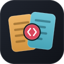

# Deck Compare — MTG

  

Chrome extension to compare Magic: The Gathering decklists side by side, across all major platforms.

## Features

- **Visual diff** — cards unique to each deck displayed as image grids, shared cards in a list with quantity deltas highlighted
- **Similarity score** — share of the larger deck the two lists have in common, with donut chart and overlap bar
- **8 supported sites** — Moxfield, MTGGoldfish, Archidekt, mtgtop8, Magic-Ville, mtgdecks.net, Melee, getpaird
- **Cross-site comparison** — compare a Moxfield deck against an mtgtop8 list, etc.
- **In-page Compare button** *(optional, off by default)* — adds a Compare button to each
  site's own toolbar, so a comparison starts without opening the popup. Enable it under
  the gear icon → *Compare button on deck sites*.
- **Your own decks** — enter your username under the gear icon and load your public decks
  from Moxfield, Archidekt or Magic-Ville; the Deck 2 field then searches all of them
- **Board filters** — All / Commanders / Mainboard / Sideboard, with every figure on the
  page recomputed for the filtered subset
- **View modes** — compact grid, responsive grid, or list
- **Card preview** — hover, click or focus any card to see the full image via Scryfall
- **Bilingual** — English / French based on browser language
- **No account needed** — no data collected, 100% client-side

## How it works

1. Open a deck on any supported site
2. Click the extension icon — or the in-page **Compare** button, if enabled. If another
   supported deck page is already open, pick it in one click; otherwise paste a second
   deck URL, or search your loaded decks by name
3. Get a full visual breakdown in a new tab — then swap the two decks, or compare against
   a different one, without leaving the page

### Permissions

The extension asks only for the sites it reads decks from. Turning on the in-page button
requests a few extra hosts at that moment, and only then: Moxfield's own pages (its decks
come from `api2.moxfield.com`, so the page itself was never needed) and the www/non-www
twins of sites declared under a single form. Declining costs you the button on those
hosts and nothing else; switching the button back off revokes them.

## Install

### From Chrome Web Store

**[Install Deck Compare — MTG](https://chromewebstore.google.com/detail/deck-compare-%E2%80%93-mtg/miijiappldgijnnokopjfiponelkdhcg)**

### Manual install (developer mode)

1. Clone this repo
2. Go to `chrome://extensions/`
3. Enable **Developer mode**
4. Click **Load unpacked** and select the project folder

## Tech

- Chrome Extension Manifest V3
- Vanilla JS, no build step
- Card images via [Scryfall API](https://scryfall.com/docs/api)
- Fonts: Bricolage Grotesque + Geist

## Privacy

No data collected. No analytics. No cookies. Everything runs locally.

See the full [Privacy Policy](https://mcouzinet.github.io/deckCompare/privacy-policy.html).

## Support

If you find this useful, consider [buying me a coffee](https://buymeacoffee.com/mcouzinet).
