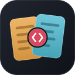

# Deck Compare — MTG

<p align="center">
  
</p>

Browser extension (Chrome, Edge, Firefox, Safari) to compare Magic: The Gathering decklists side by
side, across all major deck sites.

## Features

- **Visual diff** — cards unique to each deck displayed as image grids, shared cards in a list with quantity deltas highlighted; each zone's count copies its cards as `1 Name` lines, ready to paste into a deck builder
- **Similarity score** — share of the larger deck the two lists have in common, shown as a headline figure with an overlap bar
- **9 supported sites**: Moxfield, MTGGoldfish, Archidekt, mtgtop8, Magic-Ville, mtgdecks.net, Melee, getpaird, ManaBox
- **Cross-site comparison** — compare a Moxfield deck against an mtgtop8 list, etc.
- **In-page Compare button** *(on by default)* — adds a Compare button to each site's own
  toolbar, so a comparison starts without opening the popup. Switch it off under the gear
  icon → *Compare button on deck sites*; Moxfield and ManaBox need one extra click to allow it
  (in Settings, or in the popup itself when it opens on one of their pages).
- **Your own decks** — enter your username under the gear icon and load your public decks
  from Moxfield, Archidekt or Magic-Ville; the Deck 2 field then searches all of them
- **Board filters** — All / Commanders / Mainboard / Sideboard, with every figure on the
  page recomputed for the filtered subset
- **View modes** — compact grid, responsive grid, or list
- **Card preview** — hover, click or focus any card to see the full image via Scryfall
- **Cross-compare** — a second full-page surface: paste several decklists and see the
  most-played cards, the average decklist, the mana curve and the top sideboard cards;
  the set of decks is saved between sessions
- **Your list against the decks** (cross-compare): add your own list, kept apart and counted in
  no figure, and read it against the others: similarity to the average decklist, its share of the
  consensus, the consensus cards it misses, its cards the others rarely play and the closest deck,
  each one click from the detailed comparison. Every list marks
  the cards it plays; hover a deck in the rail to preview it the same way, click to pin it
  (a deck of the set is then measured against the others). From the popup, on a deck page, one
  click sends that deck there as your list
- **Bilingual** — English / French based on browser language
- **No account needed** — no data collected, 100% client-side

## How it works

1. Open a deck on any supported site
2. Click the extension icon — or the in-page **Compare** button. If another
   supported deck page is already open, pick it in one click; otherwise paste a second
   deck URL, or search your loaded decks by name
3. Get a full visual breakdown in a new tab — then swap the two decks, or compare against
   a different one, without leaving the page

### Permissions

The extension asks only for the sites it reads decks from, and the in-page button works
there out of the box. A few hosts are optional and only ever asked for on a click (from the
Settings panel, from the popup when it opens on such a page, or, for ManaBox, from the click that
reads a ManaBox link), never at install: Moxfield's
own pages (its decks come from `api2.moxfield.com`, so the page itself
was never needed), ManaBox, and the www/non-www twins of sites declared under a single form.
Declining costs you the button on those hosts, and on ManaBox the decks as well, except the one
open in the tab where you click the extension's icon: the extension reads them from the deck
page itself, in a background tab, and never fetches them directly.
Switching the button off revokes them.

## Install

### From Chrome Web Store

**[Install Deck Compare — MTG](https://chromewebstore.google.com/detail/deck-compare-%E2%80%93-mtg/miijiappldgijnnokopjfiponelkdhcg)**

### Microsoft Edge

**[Install from Edge Add-ons](https://microsoftedge.microsoft.com/addons/detail/deck-compare-%E2%80%93-mtg/akklkakfdidemfbbnjmhiofkhkcnhfbc)**

### Brave, Opera, Vivaldi

These Chromium browsers install the Chrome Web Store version: use the first link above.

### Firefox

**[Install from Firefox Add-ons](https://addons.mozilla.org/firefox/addon/deck-compare-mtg/)**
(Firefox 128 and later). The package is built from the same source (`npm run build` →
`dist/deckcompare-<version>-firefox.zip`). One Firefox difference: host permissions are
optional at install, so the popup shows a one-click **Allow Deck Compare on the deck sites**
button until you grant them.

### Safari

A Safari package is built from the same source (`npm run build safari` → `dist/safari/`), and the
macOS wrapper app that carries it is the Xcode project in `safari/`. The Mac App Store version is in
review.

### Manual install (developer mode)

1. Clone this repo
2. Chrome / Edge: go to `chrome://extensions/` (`edge://extensions/`), enable **Developer mode**,
   click **Load unpacked** and select the `src/` folder
3. Firefox: `npm run build`, then `about:debugging#/runtime/this-firefox` → **Load Temporary
   Add-on…** → pick `dist/firefox/manifest.json`

### Build the store packages

```bash
npm run build
```

Writes `dist/chrome/`, `dist/firefox/` and `dist/safari/` plus one zip per browser. Only the manifest differs
between targets (`scripts/build.js`); the source tree stays browser-neutral.

## Repository layout

- `src/`: the extension itself, loaded as is in development (manifest, pages, scripts, `_locales`,
  fonts, icons)
- `test/`: unit tests (`npm test`, node:test and jsdom) and their site fixtures
- `scripts/build.js`: one store package per browser in `dist/` (`npm run build`)
- `safari/`: the Xcode project of the macOS app that carries the Safari extension
- `store/`: store texts and privacy answers (`store/listing.md`), screenshots, promo art, and the
  promo video sources (`store/reel/`)
- `privacy-policy.html`: the privacy policy, served by GitHub Pages
- `AGENTS.md` (working notes), `DESIGN.md` (design system), `PRODUCT.md` (product brief),
  `CHANGELOG.md` (in French)

## Tech

- WebExtension Manifest V3 — Chrome, Edge and the other Chromium browsers, Firefox 128+
- Vanilla JS, no bundler: `src/` loads as is; `npm run build` only packages it per browser
- Card images via [Scryfall API](https://scryfall.com/docs/api)
- Fonts, all bundled in `src/fonts/` (no font is fetched): Archivo (interface), Beleren (figures and deck names), Geist Mono (measurements), Bricolage Grotesque (wordmark)

## Privacy

No data collected. No analytics. No cookies. Everything runs locally.

See the full [Privacy Policy](https://mcouzinet.github.io/deckCompare/privacy-policy.html).

## License

[MIT](LICENSE). Not covered by it: the Beleren typeface in `src/fonts/`, property of Wizards of the
Coast; Archivo, Bricolage Grotesque and Geist Mono, also in `src/fonts/`, under the SIL Open Font
License 1.1 (their license files sit beside them); and the page excerpts in `test/fixtures/`,
which remain their sites' property.

Deck Compare is unofficial Fan Content permitted under the Fan Content Policy. Not
approved/endorsed by Wizards. Portions of the materials used are property of Wizards of the
Coast. ©Wizards of the Coast LLC.

## Support

If you find this useful, consider [buying me a coffee](https://buymeacoffee.com/mcouzinet).
